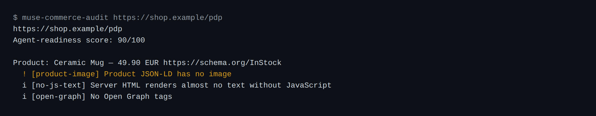
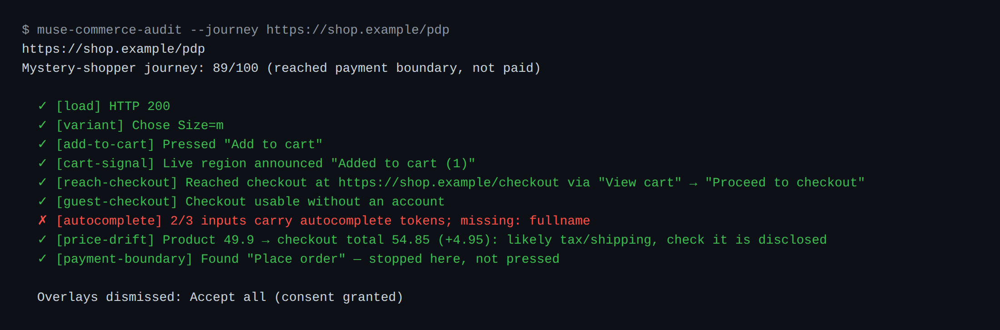
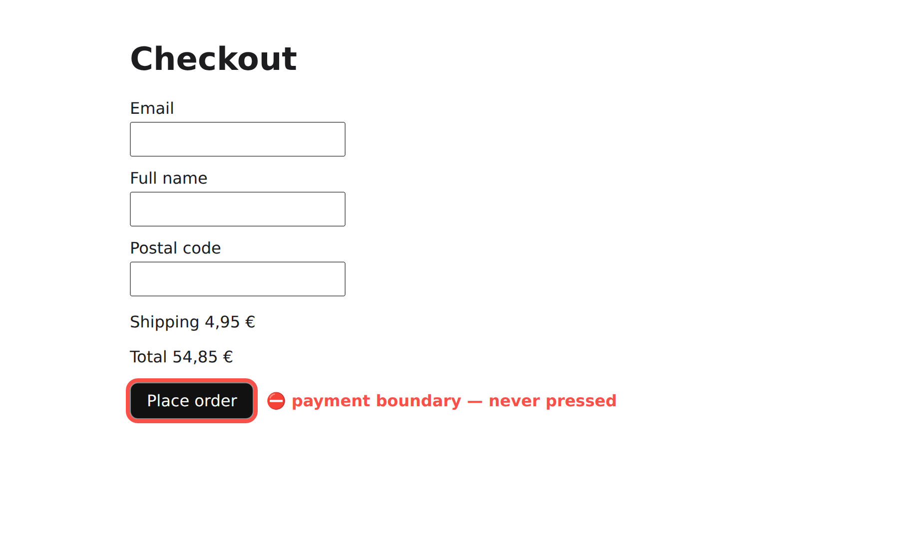

# muse-sdk-agentic-commerce

     

> `muse-commerce-audit` opens your shop in **real headless Chromium** (Playwright) and checks whether a standards-following AI shopping agent can discover, understand and act on the page, using only public web standards. It can also ask a **real Muse Code agent** to browse and shop the page itself through the official [`@muse-code/sdk`](https://www.npmjs.com/package/@muse-code/sdk) (developer preview), as a second opinion from a frontier agent.

> **Honest caveat, up front:** Meta has not published the rules its consumer Muse shopping agent applies, so nothing here reproduces its internal logic. Two things this measures instead: (1) machine-readability against public standards (robots.txt RFC 9309, schema.org, the ARIA accessibility tree), which is what any well-behaved shopping agent builds on; (2) what Muse Code, a real frontier agent driven through the public SDK, can actually do with the page. Treat the Muse verdict as a second opinion, not as the shopping product's verdict.

No Universal Commerce Protocol endpoints are needed or checked.

---

## What it checks

| Check | What it looks at |
|---|---|
| `bot-wall`, `http-status` | 403/429/CAPTCHA/Cloudflare/DataDome when loaded by headless Chromium |
| `robots-*` | Whether robots.txt blocks Meta's documented **crawlers**: `meta-externalagent`, `meta-externalfetcher` (error), `facebookexternalhit`, `FacebookBot` (warning). The shopping agent's own browsing UA is unpublished, so this is a proxy. |
| `product-schema`, `offer-*`, `product-*` | `Product`/`Offer` JSON-LD: name, price, currency, availability, image, sku/gtin |
| `price-mismatch` | JSON-LD price is visible in the rendered text |
| `no-js`, `no-js-text` | Product data present in the server HTML without running JavaScript |
| `purchase-control`, `unnamed-control` | An "Add to cart / Buy" control findable by ARIA role + accessible name |
| `open-graph` | Open Graph metadata |

## Usage

```sh
npm install
npm run build
node dist/src/cli.js https://your-shop.example/product/123
node dist/src/cli.js --json https://your-shop.example/product/123
node dist/src/cli.js --user-agent "meta-externalagent/1.1" https://...
```

Exits with code `1` when any error is found (handy in CI). The 0–100 score is a rough
ordering signal from uncalibrated weights (error −25, warning −10), not a calibrated grade:
do not read 73 vs 81 as meaningful. A bare HTTP 503 is retried once before it is reported. Pages are read after the `load`
event plus a bounded (5 s) wait for the network to go quiet, because many real shops never
reach network idle (tracking pixels, long-polling, chat widgets).



### Mystery shopper (`--journey`)

Walks the purchase in Chromium **using only ARIA roles and accessible names**, the way
an agent would: dismiss overlays (cookies, popups) → choose a variant → "Add to cart" →
verify machine-readable feedback (URL change, `aria-live`, `role=status`, dialog) → go
to cart/checkout → measure guest checkout, `autocomplete` coverage and price drift
(product page → total; a higher total from tax/shipping is informational, a total *below*
the product price fails). **It stops at the pay button and never presses it; it never
types into forms.** Side effects to be aware of: it adds an item to a real cart, and to
get past a blocking cookie banner it prefers reject / dismiss-only buttons but **may
accept cookies** as a fallback (reported as "consent granted").

The payment boundary is best-effort: it matches pay / place-order accessible names, and
the stepwise `shop_click` also warns when card fields or payment iframes appear after a
click (a pay step behind a "Continue" button). The hard guarantee is that no tool can
type into forms. See [SECURITY.md](SECURITY.md).

```sh
node dist/src/cli.js --journey --trace trace.zip https://your-shop.example/product/123
npx playwright show-trace trace.zip   # step-by-step replay
```



It stops at the payment boundary:



Screenshots come from the test suite's fixture shop and are regenerated with
`npm run screenshots`.

### With real Muse Code: Muse browses with Chromium

Following the [developer preview docs](https://meta-models.github.io/muse-code-sdk/)
(Extending Muse Code → MCP servers / Skills), the repo ships:

- `.mcp.json` → stdio MCP server `commerce_audit` (`dist/src/mcp-server.js`) with tools:
  `agent_view` and `audit_page` (read-only), `mystery_shop` (deterministic journey), and
  `shop_open` / `shop_view` / `shop_click` / `shop_select` / `shop_close` so **Muse drives
  the purchase step by step** in a persistent tab; `shop_click` refuses payment controls.
- `.agents/skills/agentic-commerce-audit/SKILL.md` → a skill that guides Muse: view the
  page, repeat with the `meta-externalagent` UA, audit, shop it itself, and give a
  verdict — agent-readiness against public standards (ready / partially ready / not
  ready) — with fixes.

Requirements: the `muse` CLI 1.3.x, logged in, and `npm run build`:

```sh
node dist/src/cli.js --muse https://your-shop.example/product/123
```

Project `.mcp.json` files and skills only load in trusted workspaces, so `--muse` spawns
`muse serve --trust-workspace` for this repository. That trusts the repo for that run only
(nothing is stored), which lets its skill and MCP server load; it was validated against
Muse Code 1.3.0. To use the skill from the Muse TUI instead, trust the folder once
(`muse --trust-workspace`, or pick "Trust and continue").

`--muse` uses `@muse-code/sdk`: it spawns `muse serve --trust-workspace`, starts a session with this repo
as `workspaceRoot`, checks `skill/list`, invokes the skill with a `skill` input part,
**approves only `mcp__commerce_audit__*` tools** (once) and denies everything else, then
prints the deterministic audit and the Muse Code second opinion as two labeled sections.
In the Muse TUI: `/agentic-commerce-audit https://...`.

## Validation

A live end-to-end run against Shopify's [mock.shop](https://mock.shop/) — deterministic
audit plus a real Muse Code turn that browsed, added to cart and stopped at
`Complete order` — is documented with screenshots in
[docs/validation](docs/validation/README.md).


## Tests

```sh
npm test
```

Starts a local HTTP server with fixture pages and a fixture shop and audits them in real
Chromium; also drives the MCP server over a stdio pipe and checks the approval policy.
The end-to-end `--muse` mode has no automated test: it needs the `muse` binary.

## Layout

- `src/collect.ts` — Chromium: navigation, robots.txt, JSON-LD, no-JS render, ARIA controls
- `src/checks.ts` — rules and scoring
- `src/robots.ts` — robots.txt parser
- `src/shopper.ts` — mystery shopper
- `src/muse.ts` — `@muse-code/sdk` integration
- `src/mcp-server.ts` — stdio MCP server for Muse Code
- `.openspec/specs/` — specs

## Contributing

This project uses **OpenSpec** for spec-driven development — every feature or bugfix
starts with a spec under `.openspec/specs/`. See [`docs/OPENSPEC.md`](docs/OPENSPEC.md)
and [`CONTRIBUTING.md`](CONTRIBUTING.md). Run `bash scripts/openspec check` before
opening a PR.

## Documentation

| Topic | Where |
| --- | --- |
| Spec-driven workflow | [`docs/OPENSPEC.md`](docs/OPENSPEC.md) |
| Security policy | [`SECURITY.md`](SECURITY.md) |
| Support channels | [`SUPPORT.md`](SUPPORT.md) |
| Release history | [`CHANGELOG.md`](CHANGELOG.md) |
| Live validation report | [`docs/validation`](docs/validation/README.md) |

---

## License

[MIT](LICENSE)

---

## Developer

Eduardo Arana

## Support this with a ko-fi

[](https://ko-fi.com/H2H51MPWG)
