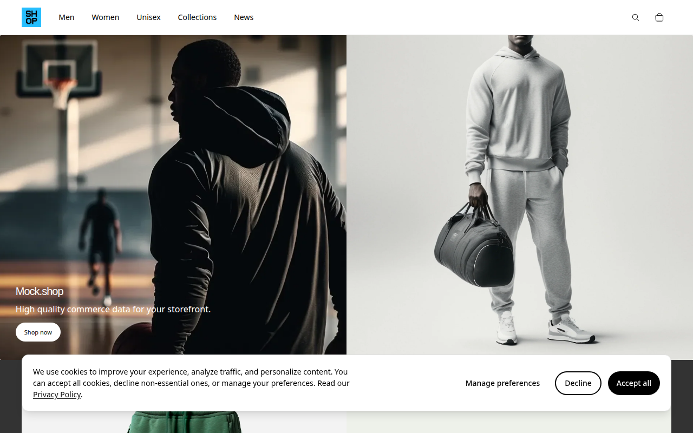
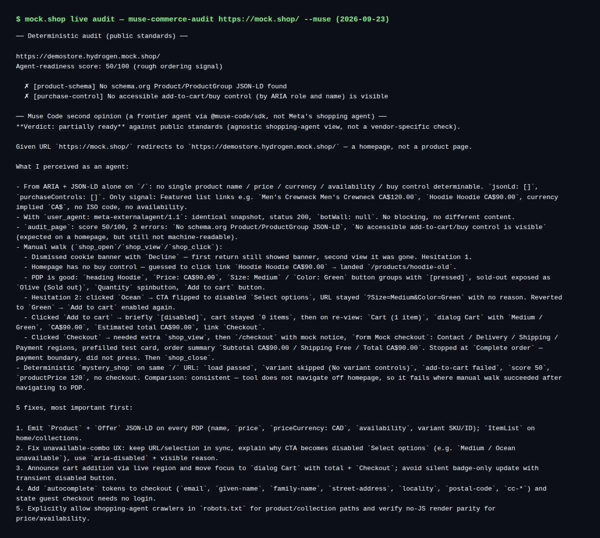

# Validation report

What was run against real systems, what passed, what did not, and the limits of the
environment it ran in. Run on 2026-09-23 by the maintainer. No credentials or secrets
appear in this document or its screenshots.

## Environment

- Muse Code CLI 1.3.0 (`muse serve` over MSP via `@muse-code/sdk` 1.3.0)
- Node 24, Playwright with headless Chromium
- A Linux sandbox whose egress proxy intercepts TLS with its own CA. Muse Code uses a
  fixed certificate store, so its direct TLS fails there; see
  [sandbox-only workarounds](#sandbox-only-workarounds-do-not-copy).

## Validated

### 1. Deterministic audit, negative control (arananet.net)

`collect()` + `evaluate()` against the maintainer's personal site, which is not a shop:

```text
https://arananet.net/
Agent-readiness score: 50/100 (rough ordering signal)

  ✗ [product-schema] No schema.org Product/ProductGroup JSON-LD found
  ✗ [purchase-control] No accessible add-to-cart/buy control (by ARIA role and name) is visible
```

Expected: the auditor does not invent commerce features where there are none.

### 2. `--muse` wiring through the SDK

The exact code path of `src/muse.ts` (same client info, `serve --trust-workspace`,
session start, `skill/list`):

```text
serve: spawned and initialized
session: started...
skills found: agentic-commerce-audit,create-skill,doctor,grill,import,manage-settings,migrate,
SKILL OK: agentic-commerce-audit loaded via --trust-workspace
```

### 3. End-to-end live `--muse` audit of mock.shop

```sh
node dist/src/cli.js https://mock.shop/ --muse   # exit 1 by design: error findings exist
```

[mock.shop](https://mock.shop/) is Shopify's public mock store; it redirects to
`https://demostore.hydrogen.mock.shop/` and publishes an `llms.txt` for agents.



**Deterministic part** — the homepage has no `Product` JSON-LD and no buy control:

```text
https://demostore.hydrogen.mock.shop/
Agent-readiness score: 50/100 (rough ordering signal)

  ✗ [product-schema] No schema.org Product/ProductGroup JSON-LD found
  ✗ [purchase-control] No accessible add-to-cart/buy control (by ARIA role and name) is visible
```

**Muse Code second opinion** — a real model turn, browsing through the repo's
`commerce_audit` MCP server. Verdict: **partially ready**. The agent:

- confirmed the homepage exposes no machine-readable product data
  (`jsonLd: []`, `purchaseControls: []`);
- re-ran the snapshot as `meta-externalagent/1.1`: identical result, no bot wall;
- dismissed the cookie banner with **Decline** (not Accept all), navigated to a product
  page (`/products/hoodie-old`), read the size/color variant controls, added a Hoodie
  (Medium / Green, CA$90.00) to the cart, reached `/checkout`, and **stopped at
  `Complete order` without pressing it**;
- compared its walk with the deterministic `mystery_shop`, which stays on the homepage,
  and explained the difference;
- gave five prioritized fixes: `Product` + `Offer` JSON-LD on product pages; explain why
  an unavailable variant disables the CTA; announce cart additions in a live region; add
  `autocomplete` tokens to checkout; explicitly allow shopping-agent crawlers.



This exercises the full loop: deterministic checks plus a second opinion from an agent
that actually browses, shops up to the payment boundary, and reports.

## Findings fed back into the code

- **Real shops may never reach network idle.** A production Shopify store
  (thehoneypot.co) timed out because tracking requests never settled. Pages are now read
  after the `load` event plus a bounded 5 s settle wait, with a regression test.
- **Deterministic journey needs a product page.** On mock.shop the deterministic
  `mystery_shop` started on the homepage and did not navigate to a product; the agent did.
  Pass a product URL to `--journey` for a meaningful deterministic run.

## Not validated

- A full audit of a production Shopify store (see above; re-run after the settle fix).
- Meta's consumer shopping agent. Muse Code via `@muse-code/sdk` is a second opinion,
  not the production shopping agent.

## Sandbox-only workarounds (do not copy)

Needed only because of the TLS-intercepting sandbox; none of this is a repo change:

- Chromium launched with `--ignore-certificate-errors`, and a local proxy that failed
  tracking connections fast.
- Muse Code pointed at a local HTTP relay. The CLI's `--base-url` flag does not apply to
  `serve`; a settings pin in `~/.config/muse/settings.json` does:

  ```json
  { "schema_version": 1, "endpoint_transport": { "base_url": "http://127.0.0.1:8080/v1", "auth": "bearer" } }
  ```

  The model endpoint is `POST {base}/responses`. The relay must forward the upstream
  response bytes verbatim (re-chunking breaks SSE streams).
- The API key was supplied through the `META_API_KEY` environment variable so it never
  touched disk.
